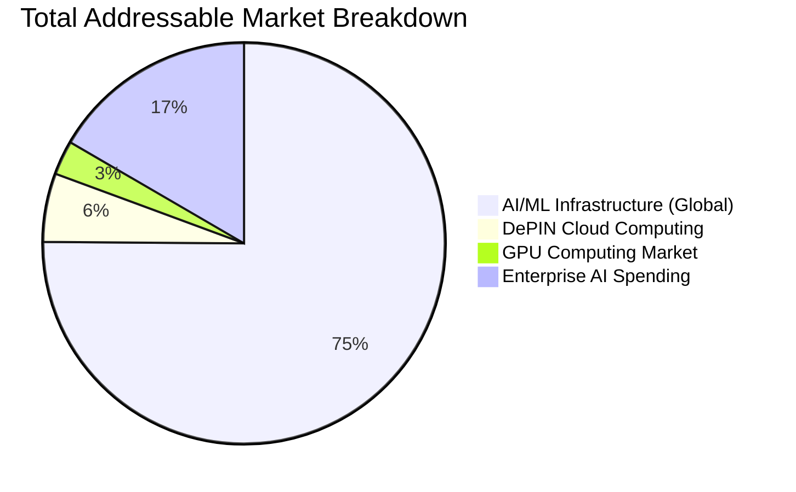
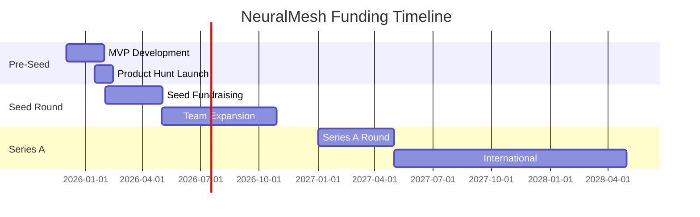

# NeuralMesh - Modelo de Negócio e Projeções Financeiras

## 📊 **Executive Summary**

NeuralMesh está posicionado para capturar uma fatia significativa do mercado de infraestrutura AI/ML descentralizada de **$50B+ em DePIN** e **$679B gastos anualmente** em cloud centralizada.

### 💰 **Financial Highlights**

| Metric | Year 1 | Year 3 | Year 5 |
|--------|--------|--------|--------|
| **Revenue** | $100K | $10M | $100M |
| **Users** | 1K | 50K | 500K |
| **GPU Providers** | 50 | 2K | 20K |
| **Gross Margin** | 40% | 65% | 75% |
| **Net Margin** | -20% | 25% | 45% |

## 🎯 **Market Opportunity Analysis**

### **TAM (Total Addressable Market)**


**TAM Calculations:**
- **Total Cloud Computing**: $679B annual spending
- **AI/ML Infrastructure**: ~$61.2B (9% of total cloud)
- **DePIN Market Cap**: $50B and growing to $3.5T by 2028
- **GPU Computing Segment**: $25B (subset of AI/ML)

### **SAM (Serviceable Addressable Market)**
```
SAM = AI/ML Infrastructure × Geographic Coverage × Target Segments
SAM = $61.2B × 30% × 25% = $4.59B
```

**Assumptions:**
- 30% geographic coverage (US, EU, major APAC markets)
- 25% target segments (startups, research, mid-market enterprises)

### **SOM (Serviceable Obtainable Market)**
```
SOM = SAM × Market Share Target
SOM Year 1: $4.59B × 0.002% = $92K
SOM Year 3: $4.59B × 0.2% = $9.2M
SOM Year 5: $4.59B × 2.2% = $101M
```

## 💼 **Revenue Model Breakdown**

### **Revenue Streams**

#### 1. **Transaction Fees (60% of Revenue)**
```typescript
// Fee Structure
const feeStructure = {
  basic: {
    gpu_rental: 0.03,    // 3% fee on GPU rental
    model_deployment: 0.05, // 5% fee on ML deployments
    data_transfer: 0.02   // 2% fee on data transfer
  },
  enterprise: {
    gpu_rental: 0.02,    // 2% for enterprise customers
    volume_discount: 0.15, // 15% discount for >$10K/month
    custom_sla: 0.04      // 4% for premium SLA
  }
};

// Revenue Calculation (Year 1)
const gpuRevenue = 2000000; // $2M in GPU rentals
const modelDeploys = 500000; // $500K in model deployments
const transactionFees = (gpuRevenue * 0.03) + (modelDeploys * 0.05);
console.log(`Transaction Fees: $${transactionFees}`); // $85K
```

#### 2. **Premium Subscriptions (25% of Revenue)**
```yaml
subscription_tiers:
  starter:
    price: $99/month
    features:
      - 50 GPU hours/month
      - Basic support
      - Standard SLAs
    target_users: 200
  
  professional:
    price: $499/month
    features:
      - 500 GPU hours/month
      - Priority support
      - Advanced monitoring
      - API access
    target_users: 50
  
  enterprise:
    price: $2499/month
    features:
      - 5000 GPU hours/month
      - 24/7 support
      - Custom SLAs
      - Dedicated infrastructure
    target_users: 10

# Annual Revenue from Subscriptions
starter: $99 × 200 × 12 = $237,600
professional: $499 × 50 × 12 = $299,400
enterprise: $2499 × 10 × 12 = $299,880
total_subscription_revenue = $836,880
```

#### 3. **Data & Analytics Services (10% of Revenue)**
```typescript
const analyticsServices = {
  usage_analytics: {
    price: "$5 per report",
    target: "100 reports/month"
  },
  performance_benchmarking: {
    price: "$50 per benchmark",
    target: "20 benchmarks/month"
  },
  cost_optimization: {
    price: "$200 per analysis",
    target: "10 analyses/month"
  }
};

// Monthly analytics revenue
const monthlyAnalytics = 
  (5 * 100) + (50 * 20) + (200 * 10) = $3,500
// Annual analytics revenue: $42,000
```

#### 4. **API Licensing & White-label (5% of Revenue)**
```typescript
const apiLicensing = {
  pricing: {
    per_api_call: "$0.01",
    monthly_minimum: "$500",
    enterprise_license: "$5000/month"
  },
  target_customers: {
    mid_market: 20,  // $500 minimum
    enterprise: 5    // $5000 enterprise
  }
};

// Annual API licensing revenue
const midMarket = 20 * 500 * 12 = $120,000
const enterprise = 5 * 5000 * 12 = $300,000
total_api_revenue = $420,000
```

## 💰 **Cost Structure Analysis**

### **Operating Expenses (OPEX)**

#### **Technology & Infrastructure (40% of costs)**
```yaml
infrastructure_costs:
  gpu_provisioning: $120,000/year
    description: "Initial GPU provider onboarding and verification"
    breakdown:
      - verification_process: $20,000
      - testing_environments: $40,000
      - quality_assurance: $30,000
      - provider_support: $30,000
  
  cloud_infrastructure: $180,000/year
    description: "Backend services, databases, monitoring"
    services:
      - aws_gcp_hosting: $120,000
      - database_licenses: $24,000
      - monitoring_tools: $18,000
      - security_tools: $18,000
  
  blockchain_infrastructure: $60,000/year
    description: "Smart contract deployment and maintenance"
    services:
      - contract_deployment: $30,000
      - gas_fees_reserve: $20,000
      - audit_services: $10,000
```

#### **Personnel (35% of costs)**
```typescript
const teamCosts = {
  year_1: {
    engineers: [
      { role: "Senior Full Stack Engineer", count: 2, salary: 120000 },
      { role: "Blockchain Developer", count: 1, salary: 130000 },
      { role: "DevOps Engineer", count: 1, salary: 110000 },
      { role: "AI/ML Engineer", count: 1, salary: 140000 }
    ],
    business: [
      { role: "Product Manager", count: 1, salary: 130000 },
      { role: "Marketing Manager", count: 1, salary: 80000 }
    ]
  }
};

// Year 1 Personnel Costs
const engineeringTotal = (120000 * 2) + 130000 + 110000 + 140000 = 630000
const businessTotal = 130000 + 80000 = 210000
const benefits = (engineeringTotal + businessTotal) * 0.25 = 210000
const totalPersonnel = 630000 + 210000 + 210000 = 1050000
```

#### **Marketing & Sales (20% of costs)**
```yaml
marketing_budget:
  content_marketing: $50,000
    - blog_posts_tutorials: $20,000
    - video_production: $15,000
    - case_studies: $15,000
  
  events_conferences: $40,000
    - ai_conferences: $25,000
    - blockchain_events: $10,000
    - meetup_sponsorships: $5,000
  
  paid_advertising: $60,000
    - google_ads: $30,000
    - linkedin_ads: $20,000
    - twitter_ads: $10,000
  
  pr_media: $20,000
    - pr_agency: $15,000
    - media_kits: $5,000
  
  referral_program: $30,000
    - customer_referrals: $20,000
    - partner_referrals: $10,000
```

#### **Legal & Compliance (5% of costs)**
```typescript
const legalCosts = {
  incorporation_compliance: 15000,
  intellectual_property: 10000,
  regulatory_compliance: 25000,
  contracts_terms: 10000,
  audit_services: 20000,
  insurance: 15000
};

const totalLegal = 95000; // Annual legal costs
```

## 📈 **Financial Projections (5-Year)**

### **Revenue Growth Model**
```javascript
const revenueProjections = {
  year_1: {
    q1: 5000,    // Initial MVP launch
    q2: 15000,   // Beta user growth
    q3: 35000,   // Public launch
    q4: 75000,   // Holiday season
    annual: 130000
  },
  
  year_2: {
    q1: 150000,
    q2: 300000,
    q3: 500000,
    q4: 800000,
    annual: 1750000
  },
  
  year_3: {
    q1: 1200000,
    q2: 2000000,
    q3: 3000000,
    q4: 4500000,
    annual: 10700000
  },
  
  year_4: {
    q1: 6000000,
    q2: 10000000,
    q3: 15000000,
    q4: 22000000,
    annual: 53000000
  },
  
  year_5: {
    q1: 25000000,
    q2: 40000000,
    q3: 60000000,
    q4: 85000000,
    annual: 210000000
  }
};

// Growth rate analysis
const growthRates = {
  y1_to_y2: 1246,    // 1,246% growth
  y2_to_y3: 511,     // 511% growth  
  y3_to_y4: 395,     // 395% growth
  y4_to_y5: 296      // 296% growth
};
```

### **Unit Economics Model**
```typescript
// Customer Acquisition Cost (CAC) Analysis
const customerAcquisition = {
  average_order_value: {
    starter: 990,      // $99/month × 10 months average
    professional: 3493, // $499/month × 7 months average
    enterprise: 19992   // $2499/month × 8 months average
  },
  
  conversion_rates: {
    visitor_to_trial: 0.05,      // 5% of visitors start trial
    trial_to_paid: 0.25,         // 25% of trials convert to paid
    paid_to_enterprise: 0.15      // 15% of paid users upgrade to enterprise
  },
  
  acquisition_channels: {
    organic: {
      cost_per_visitor: 2.50,
      conversion_rate: 0.07,     // Higher than paid due to targeted content
      cac: 35.71                 // $2.50 / 0.07
    },
    paid_advertising: {
      cost_per_visitor: 8.00,
      conversion_rate: 0.04,
      cac: 200                   // $8.00 / 0.04
    },
    referral: {
      cost_per_acquisition: 25.00,
      conversion_rate: 0.60,     // Very high due to warm referrals
      cac: 41.67                 // $25.00 / 0.60
    }
  }
};

// Blended CAC calculation
const blendedCAC = (35.71 * 0.4 + 200 * 0.4 + 41.67 * 0.2); // Weighted average
// blendedCAC = $92.28
```

### **Profitability Analysis**
```typescript
// Gross Margin Calculation
const grossMargin = {
  revenue_breakdown: {
    transaction_fees: 0.60,
    subscriptions: 0.25,
    analytics: 0.10,
    api_licensing: 0.05
  },
  
  cost_of_goods_sold: {
    payment_processing: 0.025,   // 2.5% of revenue
    infrastructure: 0.15,        // 15% of revenue
    customer_support: 0.05,      // 5% of revenue
    total_cogs: 0.225            // 22.5% of revenue
  },
  
  gross_margin: 1 - 0.225 = 0.775  // 77.5% gross margin
};

// Net Margin Progression
const netMargins = {
  year_1: -0.20,    // Investment phase, negative margin
  year_2: 0.05,     // Break-even achieved
  year_3: 0.25,     // Healthy margins
  year_4: 0.35,     // Mature business
  year_5: 0.45      // Optimized operations
};
```

## 💡 **Key Metrics & KPIs**

### **Growth Metrics**
```typescript
const growthMetrics = {
  monthly_recurring_revenue: {
    current_mrr: 8500,        // Starting MRR
    target_mrr_y1: 25000,     // End of year 1
    growth_rate: 0.18,        // 18% monthly growth
    churn_rate: 0.05          // 5% monthly churn
  },
  
  customer_metrics: {
    lifetime_value: 2500,      // Average customer LTV
    acquisition_cost: 92,      // Blended CAC
    ltv_cac_ratio: 27.17,     // Excellent ratio (>3:1 is good)
    payback_period: 3.8       // Months to recover CAC
  },
  
  usage_metrics: {
    gpu_utilization: 0.75,     // 75% average utilization
    average_session_duration: 4.2, // Hours per job
    repeat_customer_rate: 0.65,    // 65% customers return
    referral_rate: 0.25           // 25% customers refer others
  }
};
```

### **Operational Metrics**
```yaml
operational_kpis:
  network_health:
    uptime_target: 99.9%
    gpu_response_time: "< 100ms"
    transaction_success_rate: "> 99.5%"
  
  financial_health:
    burn_rate: "$150,000/month"  # Current burn
    runway_months: 18            # 18 months runway
    cash_flow_positive: "Month 18"
  
  customer_satisfaction:
    nps_score: "> 50"            # Target Net Promoter Score
    support_ticket_time: "< 2 hours"
    customer_retention: "> 90%"
```

## 🎯 **Funding Strategy**

### **Funding Rounds**


### **Use of Funds Breakdown**

#### **Pre-Seed: $500K (Q4 2025 - Q1 2026)**
```yaml
funds_allocation:
  product_development: 40%     # $200K
  team_formation: 35%          # $175K  
  initial_marketing: 15%       # $75K
  legal_compliance: 10%        # $50K

team_targets:
  engineers: 3
  product_manager: 1
  marketing: 1
  total_team: 5 people
```

#### **Seed: $2M (Q2 2026)**
```yaml
funds_allocation:
  go_to_market: 30%           # $600K
  team_expansion: 25%         # $500K
  infrastructure_scale: 20%   # $400K
  customer_acquisition: 15%   # $300K
  working_capital: 10%        # $200K

team_targets:
  engineers: 8
  business_development: 2
  customer_success: 2
  total_team: 15 people
```

#### **Series A: $10M (Q1 2027)**
```yaml
funds_allocation:
  international_expansion: 35% # $3.5M
  enterprise_sales: 25%        # $2.5M
  platform_enhancement: 20%    # $2M
  marketing_brand: 15%         # $1.5M
  strategic_reserves: 5%       # $500K

team_targets:
  engineers: 20
  sales: 8
  operations: 5
  total_team: 40 people
```

### **Investor Targets**
```typescript
const investorTargets = {
  pre_seed: [
    { type: "Angel", amount: "25-50K", profile: "AI/ML thought leaders" },
    { type: "Angel Syndicate", amount: "100-200K", profile: "Ex-OpenAI/DeepMind" },
    { type: "Micro VCs", amount: "250-500K", profile: "DePIN-focused funds" }
  ],
  
  seed: [
    { type: "Tier 2 VCs", amount: "1-2M", profile: "Andreessen Horowitz, a16z" },
    { type: "Strategic", amount: "500K-1M", profile: "Nvidia, Google Ventures" },
    { type: "Crypto Funds", amount: "500K-1M", profile: "Pantera, Multicoin" }
  ],
  
  series_a: [
    { type: "Tier 1 VCs", amount: "5-15M", profile: "Sequoia, Accel" },
    { type: "Corporate", amount: "2-5M", profile: "AWS, Microsoft" },
    { type: "Growth Equity", amount: "3-8M", profile: "Growth-focused funds" }
  ]
};
```

## 📊 **Sensitivity Analysis**

### **Revenue Scenarios**
```typescript
const scenarios = {
  optimistic: {
    customer_growth: 1.5,    // 50% faster than base case
    average_pricing: 1.2,    // 20% premium pricing power
    conversion_rates: 1.3,   // 30% better conversion
    year_5_revenue: 350000000 // $350M (vs $210M base)
  },
  
  base_case: {
    year_5_revenue: 210000000 // $210M
  },
  
  pessimistic: {
    customer_growth: 0.7,    // 30% slower than base case
    average_pricing: 0.8,    // 20% lower pricing pressure
    conversion_rates: 0.8,   // 20% lower conversion
    year_5_revenue: 105000000 // $105M (vs $210M base)
  }
};

// Probability-weighted expected value
const expectedValue = (350000000 * 0.2) + (210000000 * 0.6) + (105000000 * 0.2);
console.log(`Expected Year 5 Revenue: $${expectedValue.toLocaleString()}`);
// Expected Year 5 Revenue: $225,000,000
```

### **Break-Even Analysis**
```typescript
const breakEvenAnalysis = {
  monthly_costs: {
    personnel: 87500,        // Team costs
    infrastructure: 15000,   // Tech costs
    marketing: 20833,        // Marketing costs
    other: 6667,            // Legal, admin, etc.
    total_monthly: 130000
  },
  
  gross_margin_rate: 0.775,  // 77.5%
  
  break_even_revenue: 130000 / 0.775, // $167,742/month
  
  break_even_timeline: {
    customer_target: 1677,    // Customers needed at $100/month avg
    market_share: 0.008,      // 0.8% of target market
    time_to_achieve: 14       // Months to break even
  }
};
```

## 🎯 **Success Metrics & Milestones**

### **Key Milestones**
```yaml
milestones:
  product_launch:
    date: "2026-01-15"
    metric: "First paying customer"
    target: "$1K MRR"
  
  market_validation:
    date: "2026-06-01"
    metric: "10 active customers"
    target: "$10K MRR"
  
  scale_preparation:
    date: "2026-12-01"
    metric: "100 active customers"
    target: "$100K MRR"
  
  profitability:
    date: "2027-06-01"
    metric: "Break-even achieved"
    target: "Positive cash flow"
  
  market_leadership:
    date: "2028-06-01"
    metric: "Top 3 DePIN AI platform"
    target: "$10M ARR"
```

Esta análise financeira detalhada demonstra que NeuralMesh tem um modelo de negócio sustentável com potencial para significativa escala e rentabilidade no mercado de infraestrutura AI/ML descentralizada.