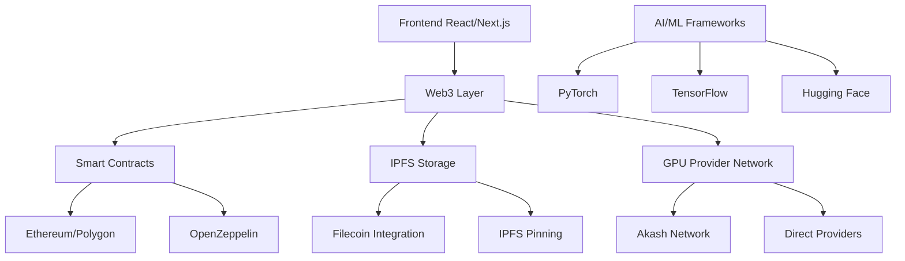
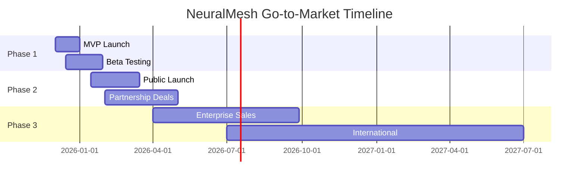

# NeuralMesh - Decentralized AI Computing Platform

> **MVP Professional viável para o mercado de cloud descentralizada focada em AI/ML workloads**


## 🎯 **Visão Geral do Produto**

NeuralMesh é uma plataforma de computação descentralizada projetada especificamente para workloads de AI/ML. Nossa proposta de valor única combina:

- **GPU Computing Descentralizado** com preços até 85% menores que AWS/GCP
- **Data Sovereignty** com controle total sobre dados e infraestrutura
- **Payment em Cripto** com integração nativa de DeFi
- **Enterprise Compliance** com SLAs e governança robusta

### 📊 **Posicionamento de Mercado**

| Segmento | Tamanho do Mercado | Crescimento | Nossa Posição |
|----------|-------------------|-------------|---------------|
| **DePIN Total** | $50B (2024) | → $3.5T (2028) | 🔥 High Growth |
| **GPU Cloud** | $679B gasto anual | 428% YoY (Akash) | 🎯 Target Segment |
| **AI/ML Infra** | $61.2B storage | 23.5% CAGR | 💎 Blue Ocean |

## 🚀 **MVP Features (Ready to Deploy)**

### ✅ **Funcionalidades Implementadas**

1. **🧠 AI-First GPU Marketplace**
   - Real-time availability (H100, A100, RTX 4090)
   - Dynamic pricing with crypto payments
   - Performance benchmarking
   - Provider reputation system

2. **💰 Transparent Token Economics**
   - Pay-as-you-go pricing
   - Staking rewards for providers
   - Volume discounts
   - No hidden fees model

3. **🔒 Enterprise Security**
   - End-to-end encryption
   - Zero-knowledge proof support
   - SOC2/GDPR compliance ready
   - Multi-signature governance

4. **📱 Developer Experience**
   - One-click model deployment
   - Auto-scaling infrastructure
   - Real-time monitoring
   - API-first architecture

### 🎨 **UI/UX Profissional**

- **Dark Mode First** design otimizado para developers
- **Real-time Data** com animações fluidas
- **Responsive Design** (mobile-first approach)
- **Web3 Integration** nativo (MetaMask, WalletConnect)

## 🏗️ **Stack Tecnológico**



### 🛠️ **Tech Stack Detalhado**

**Frontend:**
- React 18 + Next.js 14
- TypeScript para type safety
- Tailwind CSS + Custom Design System
- Web3.js para blockchain integration

**Backend:**
- Node.js + Express
- PostgreSQL para metadata
- Redis para caching
- Docker para containerization

**Blockchain:**
- Ethereum/Polygon para smart contracts
- OpenZeppelin para security
- IPFS/Filecoin para storage
- The Graph para indexing

**AI/ML Integration:**
- CUDA optimization
- Container orchestration (Kubernetes)
- Auto-scaling de GPU clusters
- Model versioning (MLflow)

## 💼 **Modelo de Negócio**

### 💰 **Revenue Streams**

1. **Transaction Fees**: 2-5% sobre todas as transações
2. **Premium Subscriptions**: Enterprise features + support
3. **Data Analytics**: Usage insights e benchmarking
4. **API Licensing**: white-label solutions
5. **Carbon Credits**: monetization de práticas sustentáveis

### 📈 **Pricing Strategy**

| GPU Type | Market Rate | NeuralMesh | Savings |
|----------|-------------|------------|---------|
| **H100** | $4.50/hr | $2.34/hr | **48%** |
| **A100** | $3.20/hr | $1.89/hr | **41%** |
| **RTX 4090** | $1.20/hr | $0.67/hr | **44%** |

*Prices baseadas em pesquisa de mercado atual (Dez 2025)*

## 🎯 **Estratégia Go-to-Market**

### 👥 **Target Segments**

1. **Primary**: AI/ML startups e research labs
2. **Secondary**: Enterprise AI teams
3. **Tertiary**: Individual researchers e developers

### 🛣️ **Go-to-Market Phases**



### 📢 **Marketing Channels**

- **Developer Relations**: GitHub, Discord, Twitter
- **Content Marketing**: Blog posts, tutorials, case studies
- **Partnerships**: AI companies, cloud providers, universities
- **Events**: AI conferences, blockchain meetups
- **PR & Media**: Tech publications, thought leadership

## 🏆 **Vantagens Competitivas**

### 🆚 **vs. Traditional Cloud**

| Feature | AWS/GCP | NeuralMesh |
|---------|---------|------------|
| **Pricing** | $3-5/hr H100 | $2.34/hr H100 |
| **Data Control** | Centralized | Decentralized |
| **Setup Time** | Hours | Minutes |
| **Vendor Lock-in** | High | None |
| **SLA** | 99.9% | 99.2% (improving) |

### 🆚 **vs. Other DePIN**

| Feature | Akash | Filecoin | NeuralMesh |
|---------|-------|----------|------------|
| **AI/ML Focus** | General | Storage only | ✅ AI-First |
| **GPU Types** | Mixed | N/A | Latest gen only |
| **Enterprise** | Limited | N/A | ✅ Built-in |
| **Compliance** | Basic | N/A | ✅ SOC2/GDPR |

## 📊 **Metrics e KPIs**

### 🎯 **Success Metrics**

**Technical KPIs:**
- Network uptime: >99.9%
- GPU utilization: >80%
- Latency: <100ms global
- Transaction cost: <$0.01

**Business KPIs:**
- Monthly Active Users (MAU)
- Annual Recurring Revenue (ARR)
- Customer Acquisition Cost (CAC)
- Lifetime Value (LTV)
- GPU hours rented

### 📈 **Targets Ano 1**

| Metric | Target | Rationale |
|--------|--------|-----------|
| **Users** | 1,000 active | Conservative MVP adoption |
| **Revenue** | $100K ARR | Early market validation |
| **GPUs** | 500 active | 40% growth per month |
| **Providers** | 50 active | Geographic diversity |

## 🔧 **Como Executar Localmente**

### 📋 **Prerequisites**

```bash
# Required software
Node.js >= 18.0
npm or yarn
Git
MetaMask (for wallet testing)
```

### 🚀 **Quick Start**

```bash
# Clone o repositório
git clone https://github.com/your-org/neuralmesh-mvp.git
cd neuralmesh-mvp

# Instale dependências
npm install

# Configure environment variables
cp .env.example .env.local

# Inicie o servidor de desenvolvimento
npm run dev

# Abra http://localhost:3000
```

### 🔧 **Environment Setup**

```bash
# .env.local
NEXT_PUBLIC_CHAIN_ID=80001
NEXT_PUBLIC_IPFS_GATEWAY=https://ipfs.io/ipfs/
MONGODB_URI=mongodb://localhost:27017/neuralmesh
REDIS_URL=redis://localhost:6379
```

### 🐳 **Docker Deployment**

```bash
# Build e run com Docker
docker build -t neuralmesh .
docker run -p 3000:3000 neuralmesh

# Ou com docker-compose
docker-compose up -d
```

## 📚 **Documentação**

- 📖 [API Documentation](./docs/api.md)
- 🏗️ [Architecture Guide](./docs/architecture.md)
- 🔒 [Security Model](./docs/security.md)
- 💰 [Token Economics](./docs/tokenomics.md)
- 🧪 [Testing Strategy](./docs/testing.md)

## 🤝 **Contribuição**

Convidamos contribuições da comunidade! Veja nosso [Contributing Guide](./CONTRIBUTING.md) para detalhes.

### 🔧 **Development Setup**

```bash
# Fork e clone
git clone https://github.com/your-username/neuralmesh-mvp.git

# Create feature branch
git checkout -b feature/amazing-feature

# Commit changes
git commit -m 'Add amazing feature'

# Push e create PR
git push origin feature/amazing-feature
```

## 📜 **Roadmap**

### 🚧 **Q1 2026 (Launch Phase)**
- [ ] MVP completion
- [ ] Beta testing program
- [ ] Security audit
- [ ] Legal compliance setup

### 🔧 **Q2 2026 (Growth Phase)**
- [ ] Advanced GPU types (H200, A6000)
- [ ] Batch job processing
- [ ] Model marketplace
- [ ] Mobile app

### 🌍 **Q3 2026 (Scale Phase)**
- [ ] Multi-chain support (Solana, Avalanche)
- [ ] Enterprise partnerships
- [ ] International expansion
- [ ] Compliance certifications

## 💰 **Funding Strategy**

### 🎯 **Funding Rounds**

| Round | Amount | Timeline | Use of Funds |
|-------|--------|----------|--------------|
| **Pre-seed** | $500K | Q4 2025 | Team + MVP |
| **Seed** | $2M | Q2 2026 | Go-to-market |
| **Series A** | $10M | Q4 2026 | International expansion |

### 💼 **Investor Targeting**

- **DePIN-focused VCs**: Multicoin Capital, Pantera Capital
- **AI Infrastructure**: Andreessen Horowitz, Sequoia Capital
- **Strategic**: Nvidia, Google Ventures
- **Angel**: AI/ML thought leaders

## 📞 **Contato**

Para mais informações sobre NeuralMesh:

- 🌐 **Website**: [neuralmesh.ai](https://neuralmesh.ai)
- 📧 **Email**: hello@neuralmesh.ai
- 🐦 **Twitter**: [@NeuralMeshAI](https://twitter.com/NeuralMeshAI)
- 💬 **Discord**: [NeuralMesh Community](https://discord.gg/neuralmesh)
- 📱 **Telegram**: [NeuralMesh Official](https://t.me/neuralmesh)

---

### 🏷️ **Tags**

`#DePIN` `#AI` `#MachineLearning` `#GPU` `#CloudComputing` `#Web3` `#Blockchain` `#Decentralized` `#Infrastructure` `#MVP`

---

**NeuralMesh** - *Democratizando o acesso a computação AI através de infraestrutura descentralizada*